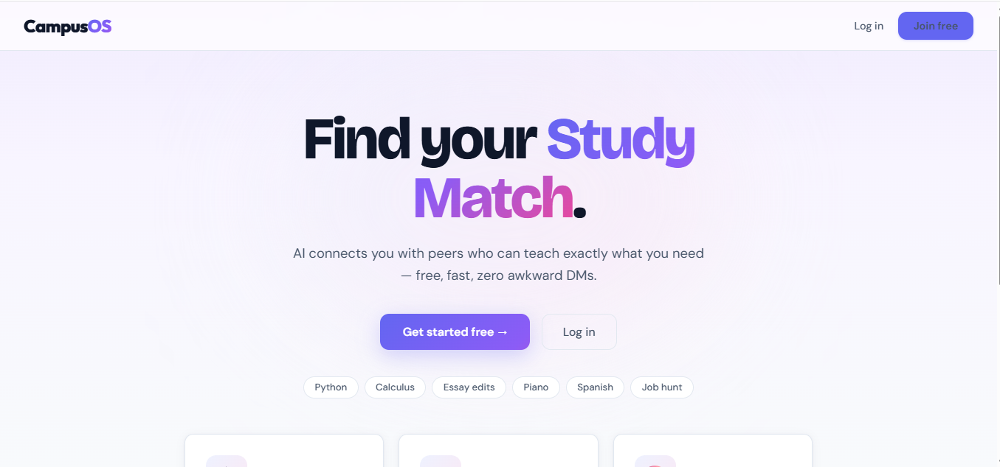
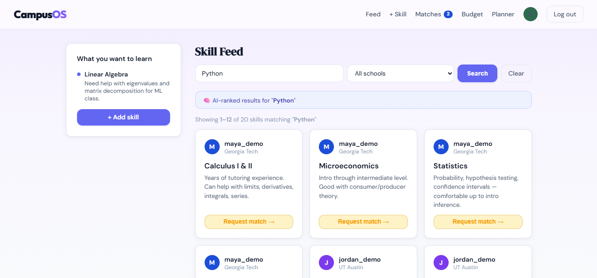
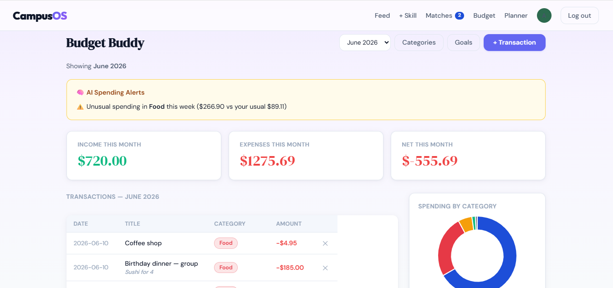
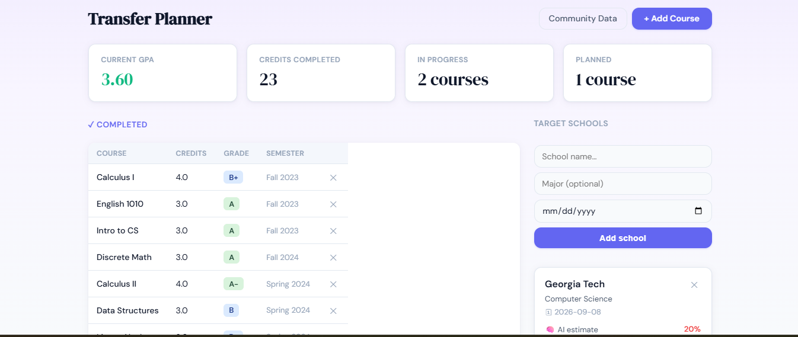

# CampusOS

> **A student super-app — skill exchange, budget tracker, and transfer planner in one Flask app, with three machine-learning features that actually do useful work in the product.**

<p>
  <strong><a href="https://getcampusos.app">→ Live demo</a></strong>
  &nbsp;·&nbsp;
  <a href="#demo">Demo</a>
  &nbsp;·&nbsp;
  <a href="#screenshots">Screenshots</a>
  &nbsp;·&nbsp;
  <a href="#tech-stack">Tech</a>
  &nbsp;·&nbsp;
  <a href="#run-it-locally">Run locally</a>
</p>

**Try it instantly** — log in as `alex_demo` / `demo1234` for a fully populated account.



---

## Demo

Logging in as `alex_demo` shows the app fully populated:
- 4 teach skills, 2 pending match requests (with a navbar badge)
- A budget with 7 weeks of category-tagged spending and an active AI anomaly alert
- 23 credits of completed coursework with an auto-calculated GPA and KNN-powered admission probabilities for 3 target schools

---

## Why it's interesting

Beyond a typical CRUD app, CampusOS ships **three real ML features**, each wrapped to degrade gracefully if scikit-learn isn't available or data is sparse:

| Feature | Algorithm | What it does |
|---|---|---|
| Skill feed search | TF-IDF + cosine similarity | Ranks the skills feed by query relevance, not just recency |
| Spending anomaly alerts | Z-score over weekly buckets | Flags categories where this week is >2σ above your typical spend |
| Transfer admission estimate | K-nearest neighbors (k=5) | Predicts admission % at a target school based on crowdsourced outcomes |

It's a single Flask app — no microservices, no ORM, no external APIs. Raw SQL on SQLite, Werkzeug auth, scikit-learn for the ML, Chart.js for visualization, vanilla JS for interactivity.

---

## What it does

### 🎓 Phase 1 — Campus Skills Exchange
Post what you can teach and what you want to learn. Browse a relevance-ranked feed (filter by school, paginated 12-per-page). Send match requests; receive a navbar badge when peers want to learn what you can teach.

### 💸 Phase 2 — Budget Buddy
Track income and expenses by category. Set savings goals with progress bars. Doughnut chart breaks down spending. Switch between months from a dropdown. AI flags unusual spending weeks automatically.

### 🎯 Phase 3 — Transfer Planner
Track completed, in-progress, and planned courses. GPA calculated automatically (credit-weighted). Add target schools — KNN estimates your admission chance from crowdsourced community data, and the community page lets you contribute your own outcome.

---

## Screenshots

| Skill feed (AI-ranked) | Budget dashboard | Transfer planner |
|:---:|:---:|:---:|
|  |  |  |
| Pagination + school filter | Anomaly alert + monthly view | KNN admission estimate |

---

## Tech stack

| Layer | Technology |
|---|---|
| Backend | Python 3.12, Flask, Flask-Session |
| Database | SQLite (raw SQL, no ORM) |
| Frontend | Jinja2, vanilla JS, hand-rolled responsive CSS |
| ML | scikit-learn (TF-IDF, cosine similarity, KNN), NumPy |
| Auth | Werkzeug password hashing |
| Charts | Chart.js |
| Deploy | Render Blueprint, gunicorn |

---

## Design decisions

**One app, not three.** All three phases share a single Flask app, single SQLite DB, and single auth system. Each phase adds tables and routes on top of the existing foundation — mirrors how real production apps grow.

**SQL over ORM.** All queries are raw SQL using `sqlite3` — the codebase reads top-to-bottom with no ORM abstraction layer in the way.

**AI that degrades gracefully.** Every ML feature is guarded: if scikit-learn isn't installed, if there's not enough data, if a query is empty — the app falls back to a sensible default rather than throwing. The app boots even with sklearn missing.

**No external APIs.** All ML runs locally. No OpenAI key, no third-party services — the app is fully self-contained and free to run.

**Idempotent migrations.** The DB schema and seed script both run `ALTER TABLE` migrations on boot, so the app can roll out schema changes without manual SQL.

---

## Run it locally

```bash
pip install -r requirements.txt
python app.py              # → http://127.0.0.1:5000
```

The database is created automatically on first run.

To populate the app with sample users and dashboards so it doesn't look empty:

```bash
python seed_demo.py            # idempotent — safe to run anytime
python seed_demo.py --reset    # wipe demo users and reseed
```

All seeded users share the password `demo1234`. Log in as `alex_demo` for the most populated account.

---

## Deploy

The repo ships with a [`render.yaml`](render.yaml) Render Blueprint. Push to GitHub, then in Render: **New + → Blueprint → connect repo → apply**. Render reads the Blueprint, sets a random `SECRET_KEY`, runs `seed_demo.py`, and serves under gunicorn.

The live URL ([getcampusos.app](https://getcampusos.app)) runs on Render's free tier — the SQLite DB is ephemeral and is reseeded on every boot. For persistent data, uncomment the `disk:` block in `render.yaml` (paid plan required) or migrate to Postgres.

---

## File structure

```
campusos/
├── app.py              # All routes, ML, context processors, migrations
├── schema.sql          # 9 tables across 3 phases
├── seed_demo.py        # Demo data — 6 users, 30 skills, full dashboards
├── render.yaml         # Render Blueprint
├── requirements.txt
├── static/
│   └── style.css
└── templates/
    ├── layout.html
    ├── index.html · register.html · login.html
    ├── feed.html · profile.html · add_skill.html · matches.html     # Phase 1
    ├── budget.html · add_transaction.html · categories.html · goals.html  # Phase 2
    └── planner.html · add_course.html · transfer_community.html     # Phase 3
```

---

## Author

Built by **[Jeremiah](https://github.com/jerebear02)** at [Vantage AI LLC](https://realvantageai.co).

Contact: [hel1o@realvantageai.co](mailto:hel1o@realvantageai.co)
